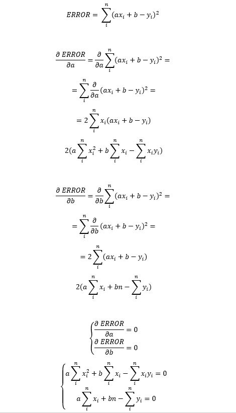
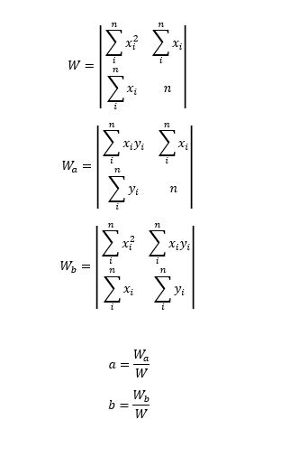

# Funkcje i metody

W tym laboratorium poćwiczymy tworzenie programów opartych
o wiele funkcji i metod.

Tak jak w poprzednim laboratorium, jedynym wymaganiem technicznym
jest zainstalowany IntelliJ Community.

## Agenda

---

1. Wstęp. Przygotowanie.
2. Rozgrzewka
3. Zadanie pierwsze.
4. Zadanie drugie.

## Wstęp. Przygotowanie.

---

Utwórz nowy projekt w IntelliJ, tak jak na poprzednich zajęciach.
Wybierz wersję `Scala 3.2.0` lub `Scala 3.2.1`. Zaznacz `Download
sources` dla sbt i Scali.

W katalogu `scr/main/scala` utwórz katalogi: `com/prz/functionsandmethods`
i w ostatnim katalogu utwórz plik `FunctionsAndMethods.scala`.
Umieść w nim nazwę pakietu i metodę główną, a w niej prosty testowy kod:

```scala
package com.prz.functionsandmethods

@main def main(): Unit =
  println("Hello!")
```

Uruchom kod i sprawdź, czy działa.


## Rozgrzewka

W języku Scala możemy tworzyć _funkcje_ i _metody_ - są to bardzo
podobne twory, jednak nie tożsame.

**Metoda** to kawałek kodu, który przetwarza dane. Ten kawałek
kodu może przyjmować argumenty. Może też zwracać wynik.
Metody definiujemy słowem kluczowym `def`.

Poniżej utworzymy przykładową metodę, która przyjmuje jako argumenty
dwie liczby całkowite `a` i `b` i zwraca liczbę całkowitą - wynik
działania `(a + 1) * b`:

```scala
def someMethod(a: Int, b: Int): Int =
  return (a + 1) * b
```

Gdy napiszemy taką metodę, możemy ją _wywołać_, np. `someMethod(1, 2)`.
Cały kod mógłby wyglądać tak:

```scala
package com.prz.functionsandmethods

def someMethod(a: Int, b: Int): Int =
  return (a + 1) * b

@main def main(): Unit = println(someMethod(1, 2))
```

Metodę możemy opisać jako _definicję zachowania jakiegoś obiektu_.
Metody mogą być częściami klas i definiować zachowania ich
obiektów (np. metoda _map_ klasy _List_). W Scali 3 (czyli wersji,
której tu używamy) można też  definiować metody, które nie są
częścią żadnej klasy czy obiektu, są "na zewnątrz" - to tzw.
_top-level definitions_.

Z kolei **funkcja** jest _obiektem_ - zachowuje się podobnie
jak np. liczba, ciąg znaków czy obiekt klasy _Person_ z poprzedniego
laboratorium - z tą różnicą, że możemy ją _wywołać_. Funkcję możemy
więc np. przechowywać w zmiennej, tworzyć
listy obiektów typu funkcja czy przekazać jako argument to metody.
Przykład:

```scala
val someFunction = (a: Int, b: Int) => (a+1)*b
```

Co robi funkcja _someFunction_? Dokładnie to samo co metoda _someMethod_
z tym, że _someFunction_ to funkcja, a _someMethod_ to metoda.
Nasz przykładowy kod mógłby wyglądać tak:

```scala
package com.prz.functionsandmethods

@main def main(): Unit =
  val someFunction = (a: Int, b: Int) => (a+1)*b
  println(someFunction(1, 2))
```


## Zadanie 1.
## Zmiany klimatu, czyli rachunek prawdopodobieństwa w praktyce

---

Wyobraź sobie zbiornik wodny. Na skutek zmian klimatu, które powodują,
że pogoda jest coraz mniej stabilna, poziom wody w zbiorniku bez
przerwy się zmienia - codziennie przybywa wody o 1 metr lub ubywa
wody o 1 metr.

Zbadamy, jaka jest szansa, że dla zadanej liczby dni poziom
wody w zbiorniku przekroczy dany próg.

Poziom wody modelujemy za pomocą błądzenia przypadkowego,
które porusza się wzdłuż osi liczbowej. Startuje z punktu 0
i w każdym kroku porusza się losowo o jednostkę w stronę
ujemną lub dodatnią.

```scala
import scala.util.Random

def randomWalkSimulations(nSteps: Int, nWalks: Int): Unit =
  val getRandomWalkSteps: Int => Array[Int] =
    (n: Int) => Array.fill(n) {
      if Random.nextBoolean() then 1 else -1
    }
  // val getWalkPositionsFromSteps: Array[Int] => Array[Int] =
  //   (steps: Array[Int]) => steps.scanLeft(0)((i,j) => i+j)
  val getWalkPositionsFromSteps: Array[Int] => Array[Int] =
    (steps: Array[Int]) => steps.scanLeft(0)(_ + _).drop(1)
  val getRandomWalkPositions: Int => Array[Int] =
    getWalkPositionsFromSteps compose getRandomWalkSteps
  val walksList: List[Array[Int]] =
    List.fill(nWalks) {
      getRandomWalkPositions(nSteps)
    }
  val didWalkReach: (Array[Int], Int) => Boolean =
    (steps: Array[Int], position: Int) => steps.count(_ >= position) > 0
  val reaches = List.range(0, nSteps + 1)
    .map((position: Int) => walksList
      .count((steps: Array[Int]) => didWalkReach(steps, position)))
  println("Reaches:")
  for
    p <- List.range(0, nSteps + 1)
  do
    var r = reaches(p)
    println(s"$p - $r")
```

Symulację przeprowadza metoda `randomWalkSimulations`, która
przyjmuje dwa parametry typu `Int`: liczbę kroków w każdym
symulowanym błądzeniu oraz liczbę realizacji błądzenia, którą chcemy
zasymulować. W metodzie definiujemy funkcje: generującą przykładowy
zestaw kroków o zadanej liczbie, tworzącą z kroków ciąg pozycji.
Symulujemy zadaną ilość realizacji błądzenia losowego.
Następnie generujemy listę wartości, której wartość na pozycji
_i_ równa jest liczbie procesów, które _dotarły_ do pozycji _i_
(to, że proces _dotarł_ do pozycji _i_ definiujemy jako fakt,
że proces po opuszczeniu pozycji początkowej był obecny przynajmniej
raz na pozycji o numerze większym bądź równym _i_.) Wyniki
prezentujemy za pomocą funkcji `println`.

Żeby zobaczyć działanie naszej metody, musimy ją wywołać w metodzie
głównej:

```scala
@main def main(): Unit =
  randomWalkSimulations(30, 100)
```

## Zadanie 2.
## Model regresji liniowej dla liczby przestępstw w Gdańsku

Zbudujemy model regresji liniowej, który opisywał będzie liczbę
przestępstw popełnionych w danej dzielnicy Gdańska na podstawie
liczby jej mieszkańców.

Naszym źródłem danych będzie portal, gdzie publikowane są otwarte dane
udostępniane przez urząd miejski w Gdańsku oraz pozostałe podmioty
[ckan.multimediagdansk.pl](https://ckan.multimediagdansk.pl/). Konkretnie,
interesować nas będą zbiory:

- Liczba przestępstw w podziale na dzielnice w Gdańsku
[https://ckan.multimediagdansk.pl/dataset/6f667d3b-4bb2-45f3-a377-f3c856b465e0/resource/7eeb36e0-e967-442e-92b1-5a05d892f29f](https://ckan.multimediagdansk.pl/dataset/6f667d3b-4bb2-45f3-a377-f3c856b465e0/resource/7eeb36e0-e967-442e-92b1-5a05d892f29f)

- Ludność Gdańska według jednostek pomocniczych
[https://ckan.multimediagdansk.pl/dataset/a0564507-fd56-4eb9-8444-1d4d70b1d5c0/resource/50c1cfc2-1608-4ba7-9f44-ffcd7f878e33](https://ckan.multimediagdansk.pl/dataset/a0564507-fd56-4eb9-8444-1d4d70b1d5c0/resource/50c1cfc2-1608-4ba7-9f44-ffcd7f878e33)

Najpierw wykorzystamy metodę z poprzednich zajęć, służącą do pobrania
i zapisania pliku.

```scala
import scala.io.Source.{fromURL, fromFile}
import java.net.URL
import java.io.{File, FileReader, FileWriter, IOException}

def downloadFile(fileToDownload: URL, outName: String): Unit =
  println(s"Tring to download file $fileToDownload")
try
val src = fromURL(fileToDownload)
val out = FileWriter(outName)
out.write(src.mkString)
out.close()
println("Done. Closing file.")
catch
case e: IOException => "Cannot download/save file."
```

Za pomocą tej metody pobierzemy ze strony automatycznie pliki CSV
i zapiszemy je w plikach na naszym komputerze.

Następnie piszemy metodę `gdanskCrimesInDistrictsExtract`, która
będzie ściągać odpowiednie dane, przetwarzać je i zwracać
listę krotek (`Tuple`), gdzie każda tupla będzie odpowiadać
którejś dzielnicy i będzie postaci (_populacja-dzielnicy_, _liczba-przestępstw-w-dzielnicy_).

Pod kodem zamieszczone jest dokładne wyjaśnienie krok po kroku
jej działania.

```scala
import scala.util.matching.Regex

/** Extracts data about Gdansk's districts' population and number
 * of crimes
 *
 * Method downloads CSV files from https://ckan.multimediagdansk.pl,
 * saves CSV files, performs fundamental data cleaning
 * and returns data as list of tuples.
 *
 * @return list of data entries: (population, number-of-crimes)
 *         for each district
 */
def gdanskCrimesInDistrictsExtract(): List[(Int, Int)] =
  val urlStringPopulace = "https://ckan.multimediagdansk.pl/dataset/a0564507-fd56-4eb9-8444-1d4d70b1d5c0/resource/50c1cfc2-1608-4ba7-9f44-ffcd7f878e33/download/ludnosc-gdanska-wg-jednostek-pomocniczych.csv"
  downloadFile(
    URL(urlStringPopulace), "gdansk-districts-populace.csv"
  )
  val urlStringCrime = "https://ckan.multimediagdansk.pl/dataset/6f667d3b-4bb2-45f3-a377-f3c856b465e0/resource/7eeb36e0-e967-442e-92b1-5a05d892f29f/download/liczba-przestpstw-w-podziale-na-dzielnice-gdaska-w-latach-2015-2017-uszeregowano-rosnco-arkusz1.csv"
  downloadFile(
    URL(urlStringCrime), "gdansk-districts-crime.csv"
  )
  val filePopulace = fromFile("gdansk-districts-populace.csv")
  val fileCrime = fromFile("gdansk-districts-crime.csv")
  val cleanPopulDistrict = (district: String) => {
    if district.contains("Stogi") then "Stogi"
    else if district.contains("Wrzeszcz Dolny") then "Wrzeszcz Dolny"
    else if district.contains("Chełm") then "Chełm"
    else district
  }
  val quotesNumberRegex = """"([\d]+),([\d]+)"""".r
  val districtsPopulations = filePopulace.getLines()
    .map(_.split(";"))
    .filter(_(0).forall(_.isDigit))
    .filter(_(0) == "2017")
    .foldLeft(Map.empty[String, Int]) {
      (populMap, lineParts) => populMap + (cleanPopulDistrict(lineParts(1)) -> lineParts(2).toInt)
    }
  val data: List[(Int, Int)] = List()
  val districtsCrime = fileCrime.getLines()
    .map(quotesNumberRegex.replaceAllIn(_, m => m.group(1) + m.group(2)))
    .filter(_(0).isDigit)
    .map(_.split(','))
    .foldLeft(data){
      (tuplesList, parts) =>
        if districtsPopulations.isDefinedAt(parts(1)) then
          tuplesList :+ (districtsPopulations(parts(1)), parts(4).toInt)
        else tuplesList
    }
  districtsCrime
```

Tajemnicze linijki pomiędzy `/**` i `*/` narazie pomińmy - nie
mają one znaczenia dla działania metody, ale pełnią inną funkcję,
którą wyjaśnimy później. Metoda `gdanskCrimesInDistrictsExtract`
nie przyjmuje żadnych argumentów, a zwracać ma obiekt typu
`List`, który zawierać będzie nasze dane.

Na początku definiujemy zmienne przechowujące adresy URL plików
z danymi. Pobieramy i zapisujemy pliki z pomocą metody `downloadFile`.
Następnie tworzymy obiekty `fromFile`: `filePopulace` oraz `fileCrime`,
które będą zczytywać i przechowywać  kolejne linijki naszych plików.

Jeśli otworzylibyśmy oba pliki i je porównali, dostrzeglibyśmy
problem - niektóre dzielnice mają niespójne nazwy w jednym i drugim
pliku. Funkcja `cleanPopulDistrict` służy do dostosowania nazw z pliku
z liczbą ludności - przyjmuje ona nazwę dzielnicy (ciąg znaków `district`)
i dokonuje drobnego przetworzenia niektórych danych.

Inny problem pojawia się w pliku z liczbą przestępstw - mamy tam przykład
linijki (wiersz 104), gdzie liczba zapisana jest w cudzysłowiu i z przecinkiem
po cyfrze tysięcy. Jeśli każemy Scali zinterpretować to jako liczbę, otrzymamy
błąd - musimy więc przetworzyć dane. Wykorzystamy do tego wyrażenie regularne -
zapisane w zmiennej `quotesNumberRegex`.

Przyszła pora, by wyciągnąć dane z plików. Najpierw dane dot. liczby mieszkańców
poszczególnych dzielnic. Tworzymy zmienną `districtPopulations`, do której
zapiszemy wynik następującego działania:

- używamy metody `getLines` obiektu `filePopulace` -> dostajemy ciąg linijek 
z pliku csv
- wartości są w pliku oddzielone średnikami `;` - za pomocą metody `map`
przekształcamy ciąg linijek w ciąg elementów, gdzie każdy element
jest ciągiem wartości z jednej linijki
- nie wszystkie linijki zawierają dane (np. linijka tytułowa); zauważamy
jednak, że wszystkie linijki z danymi mają na początku liczbę;
wykorzystujemy ten fakt, używając metody `filter`, która pozostawi tylko
te elementy (ciągi danych z linijek), gdzie każdy element będzie cyfrą
- chcemy dane tylko z 2017 roku, więc z pomocą metody `filter` je odfiltrowujemy
(podana metodzie funkcja zwróci fałsz, jeśli rok będzie różny od 2017)
- w końcu za pomocą metody `foldLeft` tworzymy obiekt typu `Map`;
obiekt typu `Map` przechowuje dane w postaci "klucz -> wartość"
u nas kluczami będą nazwy dzielnic, a wartościami liczby ich mieszkańców;
w ten sposób, gdy mamy taki obiekt i nazwę jakiejś dzielnicy, możemy łatwo
dostać się do liczby jej mieszkańców.

Następnie pobierzemy dane dot. ilości przestępstw i od razu zapiszemy
je do listy, gdzie każdy element będzie zawierał liczbę mieszkańców 
danej dzielnicy i liczbę przestępstw popełnionych w obrębie tej dzielnicy.
Każdy element będzie obiektem typu `Tuple2`, czy _krotką_ zawierającą
2 elementy. W Scali _krotki_ (_Tuple_) są typem danych podobnym do list,
z tym że mogą przechowywać elementy różnych typów. Zatem dokonujemy
na linijkach kolejnych operacji:

- oczyszczamy liczby z cudzysłowiów i przecinków z pomocą
wyrażenia regularnego
- wyrzucamy niepotrzebne liniji, w podobny sposób jak poprzednio
- każdą linijkę (będącą ciągiem znaków) rozdzielamy na wartości
  (w tym pliku są one rozdzielone przecinkiem)
- dodajemy do listy dane w ten sposób, że z każdej linijki wrzucamy
liczbę przestępstw i liczbę mieszkańców z danej dzielnicy, używając 
wcześniej utworzonej mapy.

Uzyskaną listę par wartości zwracamy (słówko _return_ jest opcjonalne;
jeśli napiszemy coś "wolno stojącego" na końcu metody, to wtedy
to coś zostanie przez metodę zwrócone.)

**Dokumentacja**. Pora wyjaśnić, cóż to za dziwne linijki nad linijką,
gdzie mamy słówko `def`. Zauważmy, że ogólnie oznaczenie `/* ... */`
oznacza wielolinijkowy komentarz - są to informacje dla czytającego kod,
ignorowane przez kompilator. Ten komentarz jednak ma w sobie coś niezwykłego.
To _dokumentacja_ naszej metody. Opisuje ona, co robi ta metoda,
jakie argumenty przyjmuje (w tym przypadku żadne) i co zwraca.
Nie ma ona żadnego wpływu na działanie programu, ale w większych projektach
jej pisanie jest kluczowe - pozwala osobie czytającej kod bądź
próbującej go użyć szybko odnaleźć się w kodzie.


Mamy już listę datapointów, teraz pora na implementację regresji liniowej.
Chcemy dopasować do danych - listy par liczb (x, y), gdzie x to populacja
dzielnicy, a y to liczba przestępstw, prostą najlepiej opisującą zależność
między nimi y = ax + b. Współczynniki a, b znajdujemy z pomocą metody
najmniejszych kwadratów i faktu, że ekstremum (tu minimum) funkcji
jest w punkcie, gdzie pochodne cząstkowe się zerują:



Mamy układ dwóch równań, szukamy współczynników a i b. Możemy
je znaleźć np. metodą wyznaczników:



Utwórzmy sobie klasę reprezentującą nasz model, by parametry modelu
regresji (współczynniki a i b) mogły być przechowywane w jednym obiekcie
(oczywiście pamiętamy o dokumentacji):

```scala
/**
 * Class representing immutable model of fitted linear regression
 * Y = a*X + b
 */
case class UnivariateLinearRegressionModel(a: Double, b: Double)
```

Napiszmy teraz metodę, która będzie przyjmować dwie listy wartości:
X i Y, i będzie na ich podstawie zwracać obiekt modelu ze współczynnikami
dopasowanymi do tych danych:

```scala
/** Returns fitted model of univariate linear regression
 * Y = x * X + b
 *
 * @param X: list of values of the predictor
 * @param Y: list of values of the predicted variable corresponding
 *           to values in X
 * @return fitted model of univariate linear regression
 */
def fitUnivariateLinearRegression(X: List[Double], Y: List[Double]): UnivariateLinearRegressionModel =
  val det2x2 = (A: Double, B: Double, C: Double, D: Double) => {
    // determinant of matrix:
    // [ A  B ]
    // [ C  D ]
    A * D - B * C
  }
  val n = X.length
  val sumXi = X.sum
  val sumYi = Y.sum
  val sumXiSquared = X.map(pow(_, 2.0)).sum
  val sumXiYi = List.range(0, n)
    .map((i: Int) => X(i) * Y(i))
    .sum
  val W = det2x2(sumXiSquared, sumXi, sumXi, n.toDouble)
  val Wa = det2x2(sumXiYi, sumXi, sumYi, n)
  val Wb = det2x2(sumXiSquared, sumXiYi, sumXi, sumYi)
  UnivariateLinearRegressionModel(Wa / W, Wb / W)
```

Mamy metodę zwracającą dopasowany model, teraz jeszcze metoda, która
na podstawie podanej wartości x i modelu poda przewidywaną wartość y:

```scala
/** For given fitted linear regression model and predictor value x,
 * computes the value predicted by this model for this value x
 */
def predictValueWithULR(model: UnivariateLinearRegressionModel, x: Double): Double =
  model.a * x + model.b
```

Mamy już wszystkie potrzebne narzędzia; napiszmy więc końcową metodę,
która ich użyje i wypisze nam jakieś wyniki:

```scala
/** Performs fitting linear regression model to population of Gdansk's districts
 * and number of crimes in each of them.
 *
 * Downloads CSV files from https://ckan.multimediagdansk.pl
 */
def regressionForCrimesInGdansk(): Unit =
  val crimesData = gdanskCrimesInDistrictsExtract()
  val populaces = crimesData.map(_ (0).toDouble)
  val crimes = crimesData.map(_ (1).toDouble)
  val model = fitUnivariateLinearRegression(populaces, crimes)
  crimesData
    .map((popul: Int, crimes: Int) => (popul, crimes, predictValueWithULR(model, popul)))
    .foreach(println)
```

Żeby zobaczyć działanie naszej metody, musimy ją wywołać w metodzie
głównej:

```scala
@main def main(): Unit =
  regressionForCrimesInGdansk()
```
