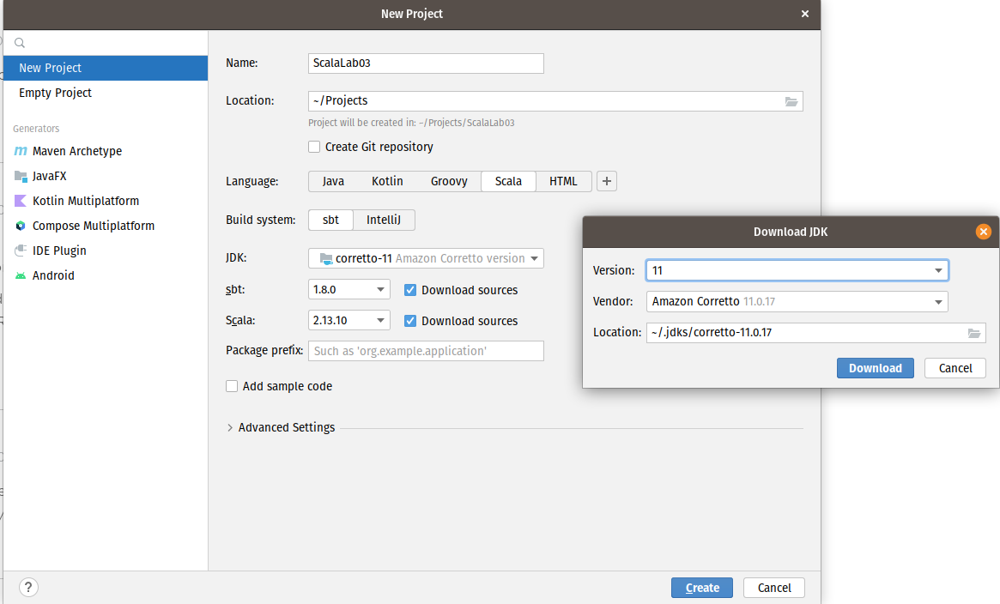
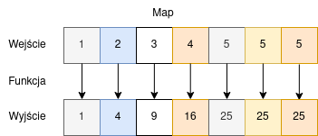
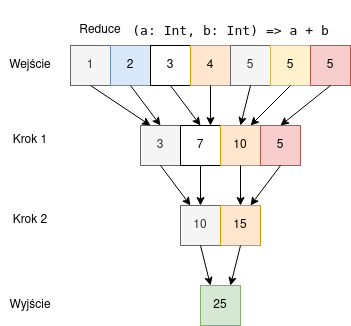
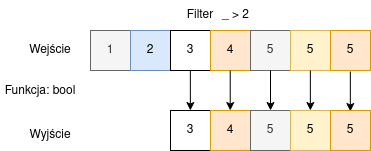
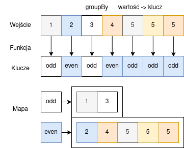
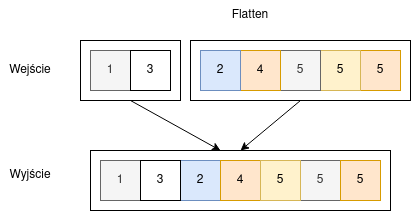

# Laboratorium 3 – Praktyczny wstęp do Apache Spark

Zacznijmy od utworzenia nowego projektu. **BARDZO WAŻNE** jest abyście zrobili to **dokładnie tak jak pokazałem to na zdjęciu** (poza ścieżkami do plików). 



## Operacje na danych w Scali

Zanim zaczniemy opowiadać czym jest spark i do czego można go wykorzystać, musimy nauczyć się jakie operacje na danych dostępne są w samej Scali. Gdyż, analogiczne operacje będziemy później przeprowadzać w Sparku.

Zacznijmy od prostego programu. Utwórz plik .scala, a w nim obiekt z metodą `main`.

```scala
package org.hello

object ScalaOperationsDemo {
  def main(args : Array[String]): Unit = {
    val data = List(1, 2, 3, 4, 5, 5, 5)
  }
}
```

### Map

To operacja, która wykonuje pewną operację, na każdym z elementów na wejściu. Operacja ta musi zwrócić wartość.



Kod w scali:

```scala
println("Map: ", data.map((x: Int) => x * x))
```

### Reduce

Nazwa sugeruje, że coś redukujemy. I tak faktycznie jest. Operacja ta polega, na tym iż konsekwentnie uruchamiamy funkcję, która przyjmuje dwa argumenty i zwraca jeden (typy wejściowe i wyjściowe są takie same). Co w sprawia, iż po wielu iteracjach pozostaje nam jeden element.



Kod w scali:

```scala
println("Reduce: ", data.reduce((a: Int, b: Int) => a + b))
```

### Filter

Każda operacja wcześniej wykonywała się na wszystkich podanych elementach, a co jeżeli nie chcemy tego robić? Na ratunek przychodzi nam filter. Przyjmuje on funkcję, która zwraca prawdę lub fałsz. Zwrócone zostaną wyłącznie te elementy, dla których funkcja ta zwróci prawdę.



Kod w scali:

```
println("Filter: ", data.filter(_ > 2))
```

### GroupBy

Łączy elementy w grupy, na podstawie klucza, który jest wartością zwracaną przez funkcję wejściową.

Na przykład, mamy funkcję, która zwraca czy liczba jest parzysta lub nieparzysta. Jeżeli użyjemy jej wraz z GroupBy na liście elementów, to otrzymamy mapę, zawierającą dwa klucze: parzysta i nieparzysta, a pod tymi kluczami znajdować się będą listy elementów, które do niej pasują.



```scala
def isEven(x: Int): String = x % 2 match {
    case 0 => "even"
    case 1 => "odd"
}
val grouped = data.groupBy((x: Int) => isEven(x))
println("GroupBy result: ", grouped)
println("GroupBy values: ", grouped.values)
```

### Flatten

Mamy listę list, jak zrobić z niej jedną długą listę? Użyj flatten!



Kod w scali:

```scala
println("Flatten: ", grouped.values.flatten)
```

## Co to Spark i jak go postawić

[Spark standalone](https://spark.apache.org/docs/latest/spark-standalone.html)
